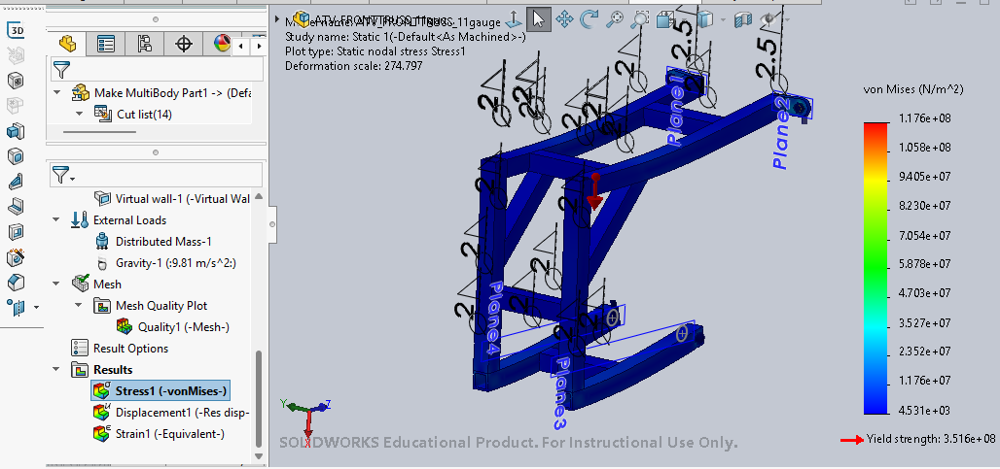
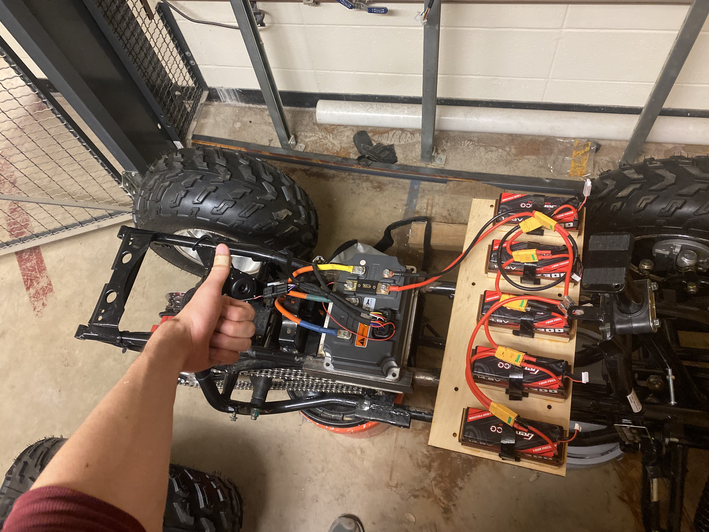
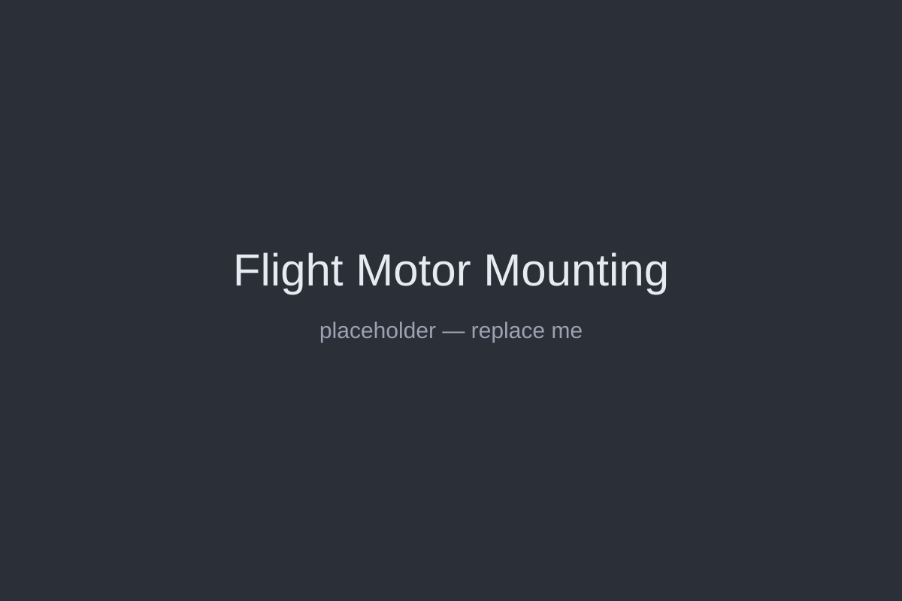
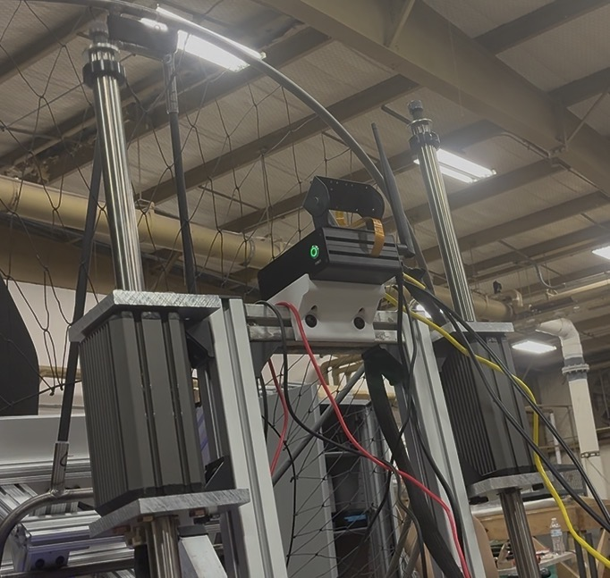
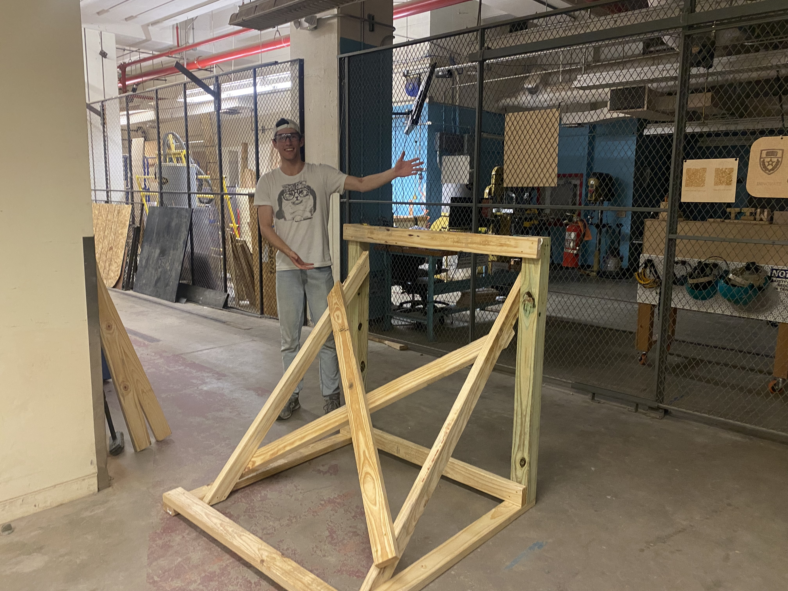
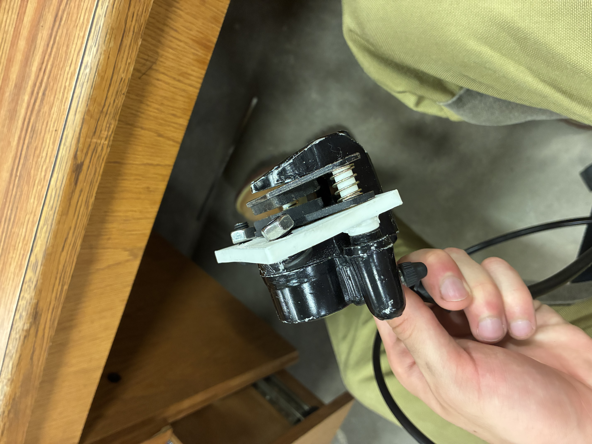

# ASCEND Contributions

## Overview

ASCEND (Aerial Solutions to Combat Emergencies and Natural Disasters) is a student engineering organization focused on developing innovative emergency-response aircraft. The team is currently competing in the GoAero competition, where we earned a GoAero Innovation Award for our vehicle concept.

Our current platform is a stripped-down ATV that has been converted into a remotely operated aircraft testbed. The vehicle integrates electric propulsion, a powered flight motor, a paraglider wing, and numerous custom mechanical and electrical systems. Every degree of freedom—from steering and braking to wing control and propulsion—is being adapted for remote operation, with the long-term goal of autonomous control.

I joined ASCEND in January 2025. During my involvement, I have contributed to mechanical design, structural analysis, fabrication, subsystem integration, testing, and leadership. By the time I assumed the role of Chief Engineer in June 2026, every major subsystem of the vehicle had been physically represented and integrated on the platform.

---

# Major Technical Contributions

## Front Frame

To balance the ATV and provide mounting locations for batteries and electronics, we needed a front frame integrated into an existing structure with four irregular mounting points located on different planes.

I took measurements, created the CAD model, performed FEA analysis, sourced materials, coordinated purchasing, and welded the final assembly. Despite the unusual mounting constraints, the resulting design was simple, low-cost, and highly rigid while providing the necessary support for future vehicle systems.

---

## Flight Motor Mounting

For initial testing of the flight motor, we needed an inexpensive and adjustable mounting solution that could connect the motor's hexagonal bolt pattern to a wooden test structure.

I developed a mounting system using 80/20 aluminum profile that we already had available. The design proved effective enough that a similar approach was later adopted for integration onto the vehicle itself. When a later iteration suffered from excessive vibration due to less rigid structural members, I redesigned the assembly and incorporated vibration-damping hardware, producing a mount capable of supporting continued testing until the final steel structure is completed.

---

## Linear Actuator Integration

I worked alongside a production team member to develop the mounting system for the vehicle's linear actuators.

An early concept relied on custom-manufactured components integrated into the existing frame, but ground-clearance concerns ultimately forced a redesign. We transitioned to an aluminum-frame solution that proved successful enough to be adopted on the vehicle.

To increase rigidity and provide future mounting locations for additional systems, we reinforced the structure with heavy-duty 40x40 aluminum channel. Near the end of the semester, I completed the final integration by designing and machining custom 10 mm aluminum adapter plates that connected the actuators to the frame. Press-fit features were incorporated to improve vibration resistance and long-term reliability.

---

## Test Infrastructure

I independently designed, sourced, fabricated, and validated two dedicated test stands.

The first was developed for flight-motor and static wing-mount testing and later became a useful platform for electronics staging and integration work. The second was designed specifically to evaluate the braking system, positioning the linear actuators in a geometry representative of their installation on the ATV.

Both stands were constructed entirely from readily available hardware-store materials and cost less than $30 each. Despite their low cost, they were highly durable and performed exactly as intended throughout testing and development.

In addition to building these systems, I trained three production team members in safe drill operation and fabrication techniques to improve the quality and efficiency of their work.

---

## Braking System

The ATV's original braking system was effectively unusable when the vehicle was acquired.

Working alongside the Program Manager, I helped lead the design and integration of an adapter that allowed us to install an off-the-shelf replacement braking system. The new assembly was successfully integrated and demonstrated substantially improved braking performance during testing.

We also incorporated provisions for future remote actuation using a linear actuator. While that functionality has not yet been fully implemented, the infrastructure required for future integration is already in place.

---

# Leadership and Team Development

Throughout my involvement with ASCEND, I have progressively taken on greater technical and leadership responsibilities.

When I first joined the organization, team members frequently approached me for design reviews, manufacturing advice, and general engineering guidance. Although I initially declined formal leadership positions, I eventually realized how much I enjoyed the work and chose to take on a larger role within the organization.

## Production Lead

As Production Lead, I focused heavily on developing the technical skills of newer members. I introduced team members to welding, machining, CAD, and the engineering design process through hands-on project work and guided them through each stage of development.

One of the areas of personal growth I am most proud of was learning how to teach problem-solving rather than simply providing solutions. My goal became helping members build confidence in finding their own answers while still providing support when necessary.

## Design Leadership

After the Design Lead stepped down, I began sharing many of those responsibilities while working closely with the Program Manager.

In this role, I reviewed CAD models, evaluated design concepts, provided technical feedback, and helped coordinate communication between the design and production teams. This significantly reduced the disconnect between design intent and manufacturing reality, improving overall team efficiency.

When I entered this role, only a small number of vehicle subsystems had been physically implemented. By the end of my tenure, every major subsystem—including steering, propulsion, wing mounting, wing control, braking, and electronics infrastructure—had a physical presence on the vehicle.

## Chief Engineer

In June 2026, I assumed the role of Chief Engineer.

In this position, I oversee major technical decisions and coordinate development efforts across the project. Because many members are away during the summer, I have also become increasingly involved in hands-on integration and testing activities.

As the ATV approaches flight readiness, I frequently serve as Test Coordinator. In this role, I conduct safety briefings, assign responsibilities, oversee testing procedures, and coordinate responses to issues that arise during operations.

---

# Impact

ASCEND has provided me with opportunities to contribute across nearly every stage of the engineering process, from early concept development and analysis to fabrication, testing, integration, and leadership.

What began as a stripped-down ATV chassis has evolved into a nearly flight-capable vehicle containing integrated propulsion, steering, braking, wing-control, and electronics systems. Contributing to that transformation—and helping other students develop their own engineering skills along the way—has been one of the most rewarding experiences of my engineering career.

As the project continues toward flight testing, I remain actively involved in guiding technical development and supporting the team through its next stage of growth.

