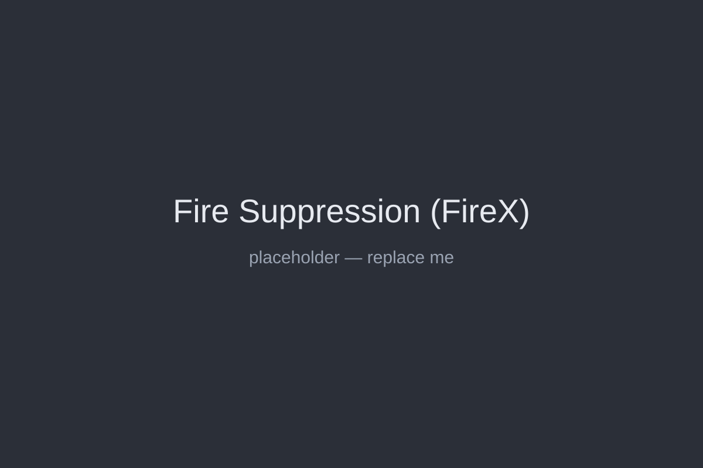
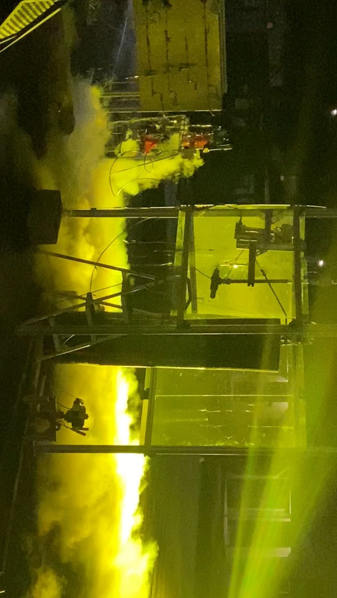
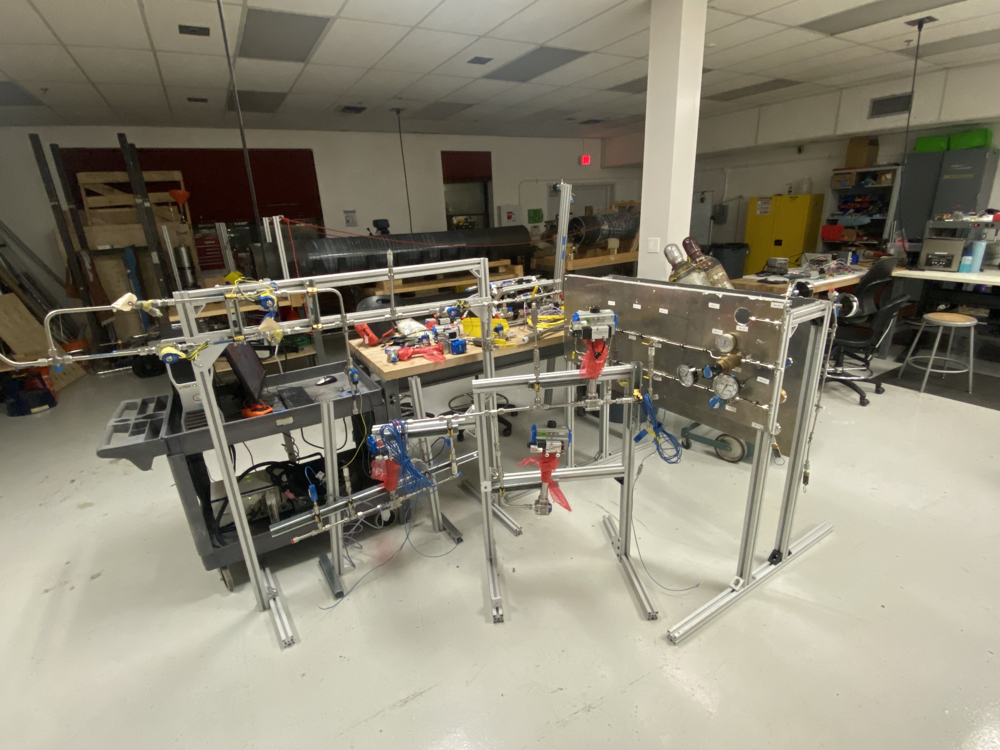
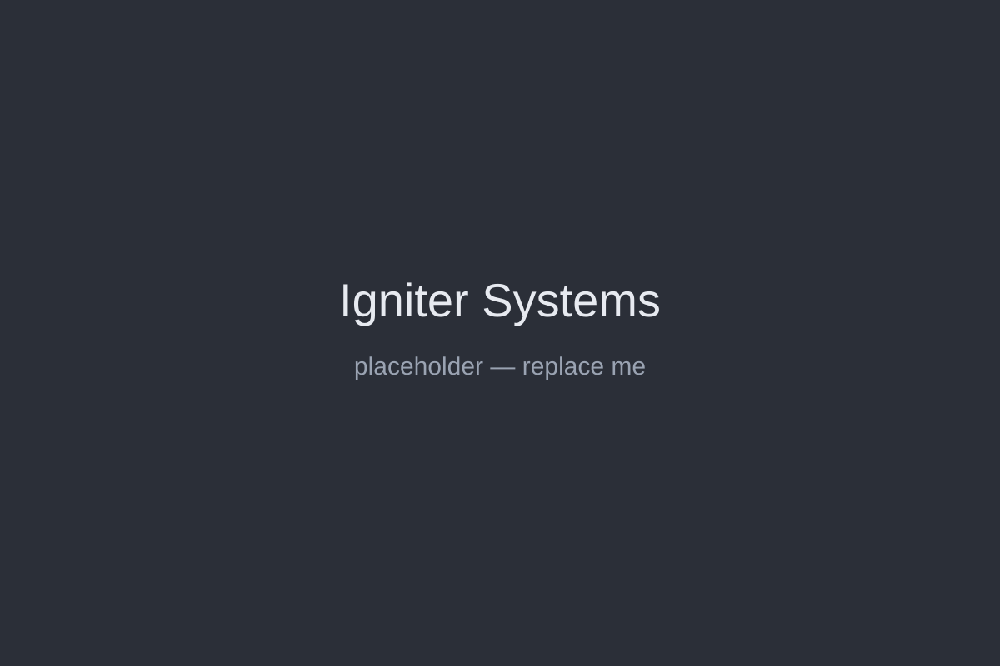
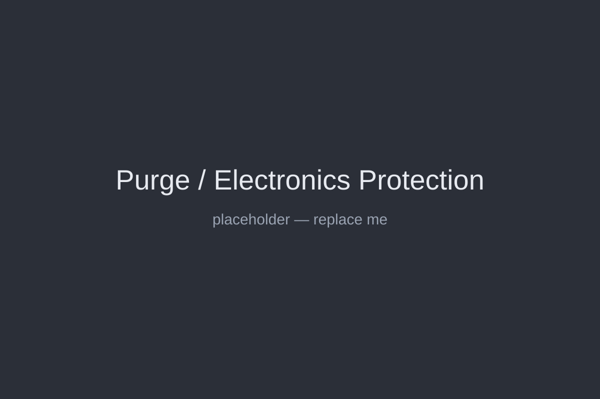
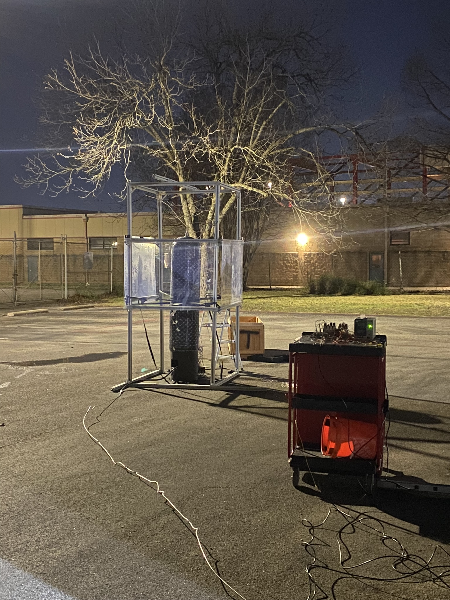

# Texas Rocket Engineering Lab (TREL) Contributions

## Overview

I joined the Texas Rocket Engineering Lab (TREL) in January 2024 as a member of the Stage Fluids team. Our responsibility was to develop and operate the ground systems required to safely store, transfer, and control all fluids used by the rocket and its supporting infrastructure.

The vehicle utilized a kerolox propulsion system, using Rocket Propellant-1 (RP-1) and liquid oxygen (LOx) as fuel and oxidizer. In addition to the primary propellants, our systems handled gaseous nitrogen (GN₂), helium (He), gaseous hydrogen (GH₂), gaseous oxygen (GOx), and water. These fluids supported vehicle propulsion, ignition, purging, pressurization, testing, and fire suppression.

I initially joined the team to learn more about fluid systems and quickly became fascinated by the engineering challenges associated with moving, storing, and controlling fluids under widely varying operating conditions. Over time, my role expanded from supporting individual subsystems to leading the design, integration, testing, and operation of nearly all ground-fluid infrastructure as the Ground Fluids Responsible Engineer.

---

> **Note:** Due to U.S. ITAR restrictions, some images on this page were taken from the lab's publicly available social media, and others are stock images.

# Major Technical Contributions

## Fire Suppression (FireX) System

One of my first major independent projects was the development of the FireX system.

The objective was to create a dedicated water-based fire suppression system capable of protecting the engine bay during testing operations. Starting from a blank sheet of paper, I designed the system architecture, selected storage tanks, determined line routing, sized tubing, sourced nozzles, and specified components capable of both broad engine-bay coverage and targeted protection of high-risk ignition points.

After completing the design, I coordinated purchasing and assembled the system. Subsequent testing demonstrated that it performed as intended and provided a critical layer of safety for engine operations.

---

## Propellant and Ground Fluid Systems

During my first semester, I contributed to the design and procurement of components for several major fluid systems.

I assisted with storage and transfer hardware selection for the liquid oxygen system and helped design portions of the RP-1 fill and drain infrastructure, including sourcing filters and supporting components. I also participated in assembling the gaseous nitrogen distribution panel, a large system responsible for routing purge and pressurization gas throughout the Ground Support Equipment (GSE).

These projects provided valuable experience in fluid-system design, component selection, pressure-system integration, and the practical realities of working with cryogenic and hazardous fluids.

---

## Mobile Ground Support Equipment (GSE) Trailer

One of the largest projects completed during my tenure as Ground Fluids Responsible Engineer was the development of a mobile Ground Support Equipment (GSE) trailer.

As vehicle requirements evolved, our fluid systems could no longer exist as independent assemblies. They needed to function as a cohesive field-deployable platform capable of supporting transportation, setup, testing, and launch operations. I led the redesign and integration of numerous fluid subsystems onto a single trailer platform, incorporating liquid oxygen, RP-1, gaseous nitrogen, gaseous hydrogen, gaseous oxygen, helium, and water systems.

This effort required extensive coordination across structures, electronics, software, and propulsion teams. Routing, mounting, maintenance accessibility, operational safety, and changing vehicle requirements all had to be considered simultaneously.

The completed trailer became the backbone of operations at our Pancake, Texas test site and was critical to supporting cold-flow testing. What began as a collection of independent fluid systems ultimately became a unified and deployable ground-support platform capable of supporting full vehicle operations.

---

## Igniter Systems

I helped lead the development and integration of the gaseous hydrogen and gaseous oxygen systems used to support engine ignition.

These systems incorporated electronically controlled pressure regulators and required close coordination with electronics, software, and propulsion teams to ensure safe and reliable operation. The work involved component selection, plumbing design, integration planning, and testing support.

As vehicle requirements evolved, these systems underwent multiple design revisions, requiring continual adaptation while maintaining safety and functionality.

---

## Purge and Electronics Protection Systems

To improve operational reliability and safety, I designed and implemented a dedicated purge system for critical electronics enclosures.

The system continuously supplied clean gaseous nitrogen to junction boxes and electrical hardware, preventing contamination and reducing the risk of hazardous gas accumulation near sensitive electronics. This became particularly important when operating around cryogenic oxidizers, fuels, and ignition hardware, where maintaining controlled environments around electrical systems is essential.

Although relatively small compared to the larger fluid systems, this project highlighted the importance of systems-level thinking and supporting infrastructure in safe rocket operations.

---

## Automation and Controls

In addition to mechanical and fluid-system design, I contributed to automation efforts supporting cryogenic operations.

I developed a state-machine-based controller for the liquid oxygen fill process. The system automated a "bang-bang" control strategy, in which valves operating only in fully open or fully closed states were used to maintain pressure within a specified operating range.

Developing this controller required understanding both the behavior of the fluid system and the operational constraints imposed by the hardware. The resulting automation reduced operator workload and improved consistency during filling operations.

---

## Testing Operations

Testing was a major component of my work within TREL.

I participated extensively in subsystem assembly, leak checking, plumbing installation, instrumentation setup, and operational support during testing campaigns. At our Pancake, Texas test site, this often meant long days spent assembling fluid systems, running lines, rebuilding panels, configuring manifolds, and preparing hardware for operations.

I contributed to the successful execution of five cold-flow tests and helped support proof-testing and autofrettage operations involving composite overwrapped pressure vessels (COPVs). I also assisted with instrumentation efforts, including differential-pressure sensor validation using the Water Flow Test Stand and installation of strain-gauge systems for structural testing.

As Responsible Engineer, I coordinated critical testing activities and monitored system conditions to ensure safe operation. During fill and drain testing, this included closely monitoring pressures and thermal conditions to mitigate risks associated with cryogenic loading.

---

## Water Flow Test Stand

I played a significant role in maintaining and improving the Water Flow Test Stand (WFTS), a key development platform used for instrumentation and fluid-system testing.

Early in the semester, I rebuilt portions of the stand, replacing a leaking valve and modifying the orifice configuration to support future testing. The stand was subsequently used to validate differential-pressure sensors and verify instrumentation performance. I operated the data acquisition software, collected test data, and cross-referenced sensor readings against physical instrumentation to identify potential discrepancies.

While smaller in scope than many of the major fluid systems, the WFTS provided valuable experience in experimental validation, instrumentation, troubleshooting, and test execution.

---

# Leadership and Impact

My second semester marked a major transition when I was selected as Ground Fluids Responsible Engineer.

The position placed me in charge of one of the largest and most interdisciplinary teams within the organization. Despite the team being reduced to roughly half its previous size, we significantly expanded both the quantity and capability of operational hardware produced during the year.

As Responsible Engineer, I coordinated design efforts, managed procurement, maintained documentation, developed and reviewed P&IDs, and worked closely with structures, electronics, software, propulsion, and vehicle teams to ensure successful integration of fluid systems across the project.

The role required balancing technical performance with operational safety while working with cryogenic oxidizers, high-pressure gases, flammable fuels, and ignition systems. Every design decision required careful consideration of both engineering requirements and risk management.

Perhaps the accomplishment I am most proud of is helping transform a collection of partially developed fluid subsystems into a cohesive operational architecture capable of fueling, purging, protecting, and testing a liquid-propellant rocket in the field. Through the development of the FireX system, purge systems, propellant infrastructure, igniter systems, automation, and the mobile GSE trailer, our team created the foundation necessary to support major vehicle testing campaigns.

The experience provided practical knowledge of fluid mechanics, pressure systems, controls, systems engineering, and engineering leadership that extends far beyond the classroom. More importantly, it taught me how to coordinate large technical efforts, make decisions under uncertainty, and lead teams through ambitious engineering projects while maintaining a strong commitment to safety and reliability.
