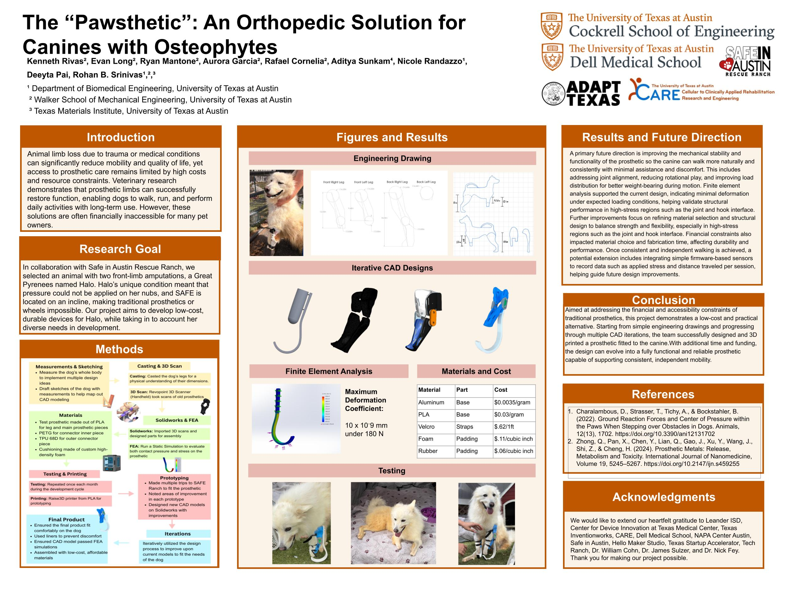
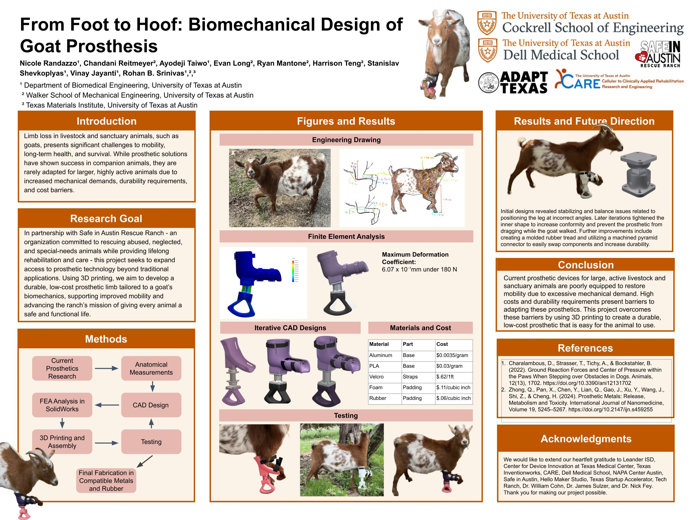
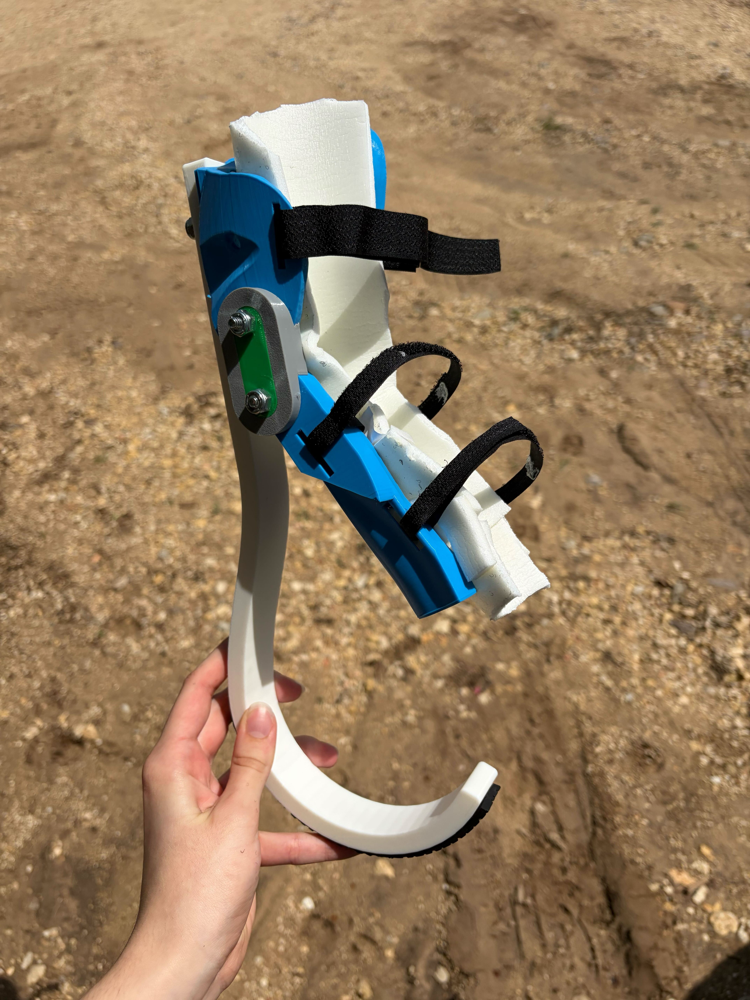

# ADAPT

*Add a short introduction to ADAPT and the animal-prosthetics project here — what the team set out to do and why it mattered.*

Over the course of the semester, our team designed and prototyped prosthetics to improve the lives of animals in need. **The two research posters below were the culmination of that work.**

## Research Posters

## My Involvement

*Coming soon — detail your specific role and contributions here (design, FEA/analysis, fabrication, testing, coordination, etc.). The dog-blade FEA shown at the top of this page is one example of that work.*

## Behind the Scenes

*A few favorite moments from the project that didn't make it onto the posters. Replace the placeholders below with your own photos — drop them into this folder and update the image names.*

