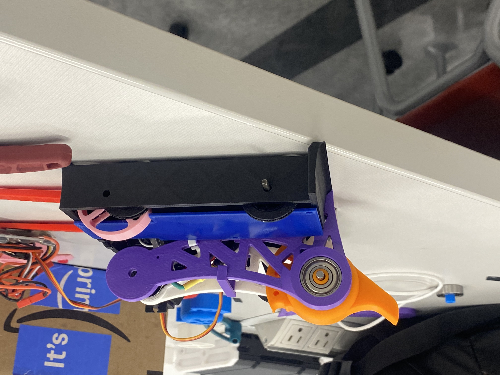
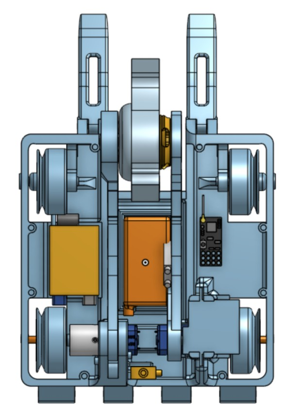
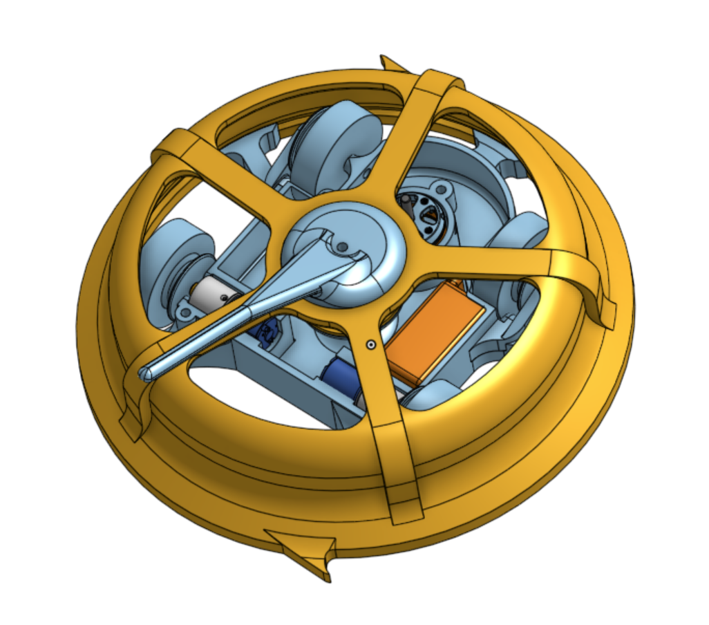
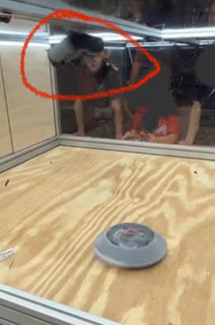
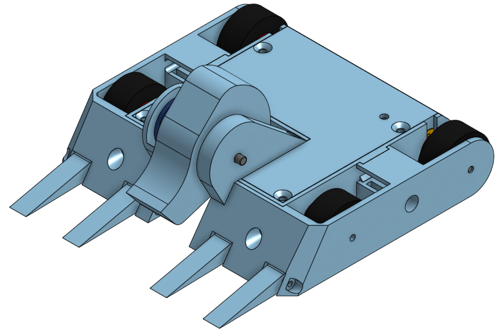
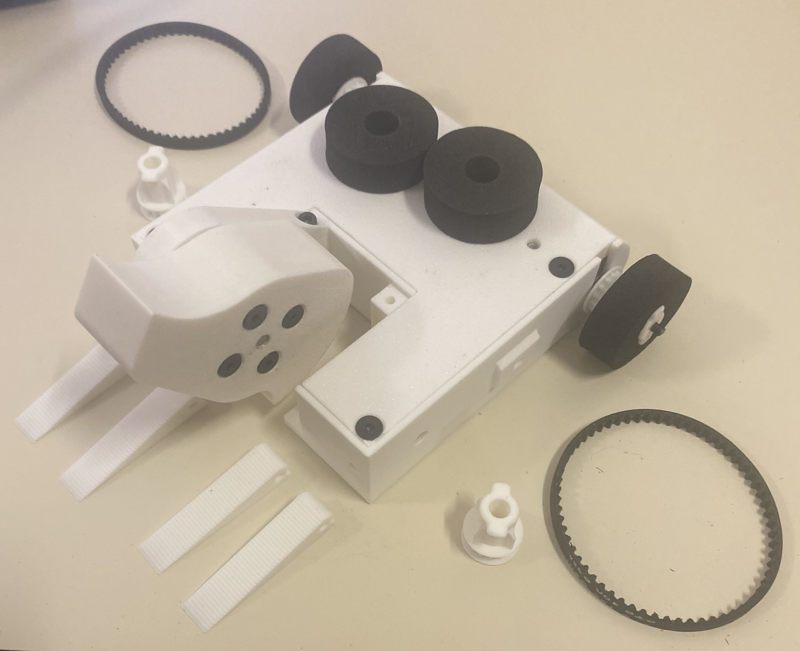
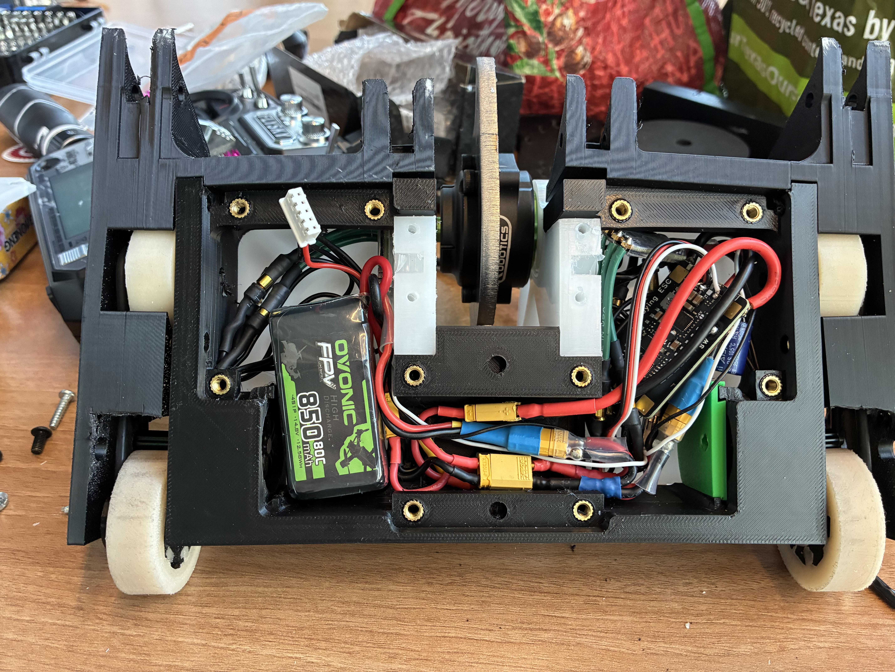
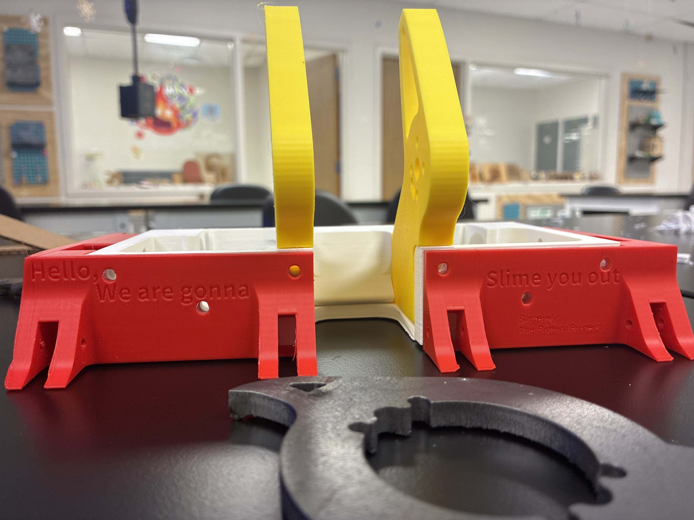

# Experimental Division Combat Robotics (ExD)

## Overview

The University of Texas combat robotics organization, Experimental Division Combat Robotics (ExD), provides students with opportunities to design, manufacture, and compete with robots across several weight classes.

Most new members begin in the 1-pound PLAntweight division, where all non-electronic components must be manufactured from 3D-printable plastics. The restrictions keep costs low and make the competition highly accessible while still encouraging creativity and technical problem-solving. More advanced members often move into the Antweight and Beetleweight divisions, where robots are permitted to use materials such as hardened steel, titanium, carbon fiber, TPU, and other engineering materials.

I joined ExD during the second semester of my freshman year. Over time, combat robotics became one of my favorite engineering outlets because it compresses the entire engineering process—design, manufacturing, testing, failure analysis, iteration, and competition—into a matter of weeks. Every robot taught me something different, and many of the lessons came from failures rather than successes.

## Major Projects

### Hawk

My first combat robot was an ambitious PLAntweight hammersaw named Hawk.

Rather than starting with a simple design, I decided to attempt one of the most mechanically complicated robot archetypes in the sport. The goal was to create a hammersaw robot whose weapon arm could retract far enough that the robot could also function as a traditional vertical spinner.

The design underwent numerous revisions as I encountered nearly every challenge a new builder could face: electronics packaging, structural rigidity, armor design, weight distribution, manufacturing tolerances, and weight limits. Although the final robot successfully functioned as a hammersaw, the packaging constraints prevented the arm from retracting far enough to achieve the dual-purpose functionality I originally envisioned.

In competition, Hawk struggled. The robot was overweight in some areas and poorly balanced, with much of its mass concentrated around the weapon servo. As a result, maneuverability suffered and the robot was frequently out-controlled by opponents.

While Hawk was not competitively successful, it taught me more about design constraints and practical engineering than any classroom project I had completed up to that point.

### Beetle and Goomba

After Hawk, I intentionally moved in the opposite direction and attempted to build the simplest robot possible.

The concept behind Beetle was straightforward: package the electronics into the smallest possible chassis and devote nearly every remaining gram to a spinning shell weapon. The original design featured a compact and highly symmetrical layout, but practical constraints quickly emerged. The drive motors occupied far more space than anticipated, forcing a substantial redesign.

The result was Goomba.

Goomba sacrificed aesthetics for functionality. The elegant symmetrical chassis was replaced by an awkward mushroom-shaped structure that flexed under its own weight, but every component fit and the robot functioned reliably. The shell weapon, complete with removable teeth, weighed more than the rest of the robot combined.

Driving Goomba was an experience in itself. Once the weapon reached full speed, the robot often behaved according to its own interpretation of physics, with joystick inputs acting more as suggestions than commands. The strategy was generally simple: reach full speed and remain somewhere near the center of the arena.

Despite its flaws, Goomba earned my first victory outside the university at a regional competition in Houston, making it one of my most memorable robots.

### Drum Spinner Development

Following Goomba, I shifted my focus toward competitive performance and began developing a series of drum-spinner robots.

These robots featured large "buck-toothed" drum weapons designed to maximize impact energy. Several iterations competed at both campus and regional events, consistently achieving mid-tier results.

Although the weapons delivered impressive hits, the designs taught me an important lesson about combat robotics: raw power is only valuable if the robot can consistently apply it. The large drums carried significant rotational inertia, which reduced maneuverability and made it difficult to capitalize on opportunities during matches.

Through these designs, I began to appreciate the importance of balancing weapon effectiveness with controllability and driver performance.

### Anklebiter

The culmination of those lessons was Anklebiter.

Developed in collaboration with another ExD member, Anklebiter was designed around a simple philosophy: prioritize control, reliability, and maneuverability while maintaining an effective weapon.

After evaluating successful designs across the sport, we settled on a four-wheel-drive platform paired with a relatively small vertical spinner. The resulting robot was significantly easier to drive than my previous designs while still retaining meaningful offensive capability.

The design proved successful. After a strong season of competition at UT Austin, Anklebiter qualified to represent the university at Comet Clash, one of the largest collegiate combat robotics events in Texas.

Following a full day of competition, Anklebiter finished in second place within its division.

More importantly, the robot demonstrated the value of iterative design. Rather than attempting to maximize a single performance metric, we built a balanced machine that could consistently execute its intended strategy.

### BajaBot

My first exposure to the Beetleweight class came through BajaBot, a robot developed for Texas Robo Rumble 2024.

While I was not heavily involved in the overall design process, I contributed to chassis development and manufacturing preparation, including creating profiles for machined components. The project provided valuable exposure to larger combat robots and the manufacturing processes required to build them.

### Gemini

My most recent combat robotics project is Gemini, a 3-pound Beetleweight robot that I designed and manufactured almost entirely myself.

Gemini was built around the philosophy of controlled flexibility. Rather than relying solely on rigid structures, many components were intentionally designed to absorb impacts without catastrophic failure.

The primary chassis was constructed from TPU 98A to provide stiffness while maintaining toughness. Armor panels used softer TPU 90A to maximize resilience and minimize permanent deformation after impacts. Structural components, including the weapon supports and top and bottom panels, were machined from ultra-high-molecular-weight polyethylene (UHMW), balancing rigidity with impact resistance.

I personally designed, machined, and iterated on all UHMW components using CNC equipment in the university makerspace. The weapon and forks were plasma-cut from AR600 steel to maximize hardness and wear resistance.

Gemini competed at Comet Clash with a record of 1-2. The primary challenge was not structural performance but controls integration. The event marked our team's first extensive use of brushless motors for drivetrain applications, and persistent motor-mixing issues prevented the robot from responding consistently to driver inputs.

When the controls behaved correctly, Gemini demonstrated excellent mobility and handling. Unfortunately, the issues proved difficult to resolve during competition. The robot's final match ended after a particularly severe impact nearly severed one of the weapon-support structures.

Although the results did not fully reflect the design's potential, Gemini provided valuable experience in advanced materials, CNC manufacturing, drivetrain integration, and failure analysis.

## Impact and Lessons Learned

Combat robotics has been one of the most effective engineering learning environments I have experienced.

Unlike traditional academic projects, every design decision is immediately tested under extreme conditions. Robots fail dramatically, assumptions are exposed quickly, and successful designs are rewarded just as rapidly. The rapid design-build-test cycle forces continuous iteration and encourages practical problem-solving.

Over multiple generations of robots, I progressed from building ambitious but flawed concepts to developing more balanced and competitive machines. Along the way, I gained experience in CAD, additive manufacturing, machining, materials selection, electronics integration, controls, failure analysis, and competition strategy.

More importantly, combat robotics taught me that good engineering is rarely about maximizing a single metric. The most successful designs are often the ones that strike the best balance between performance, reliability, manufacturability, and controllability—a lesson that continues to influence my work in every engineering project I undertake.
